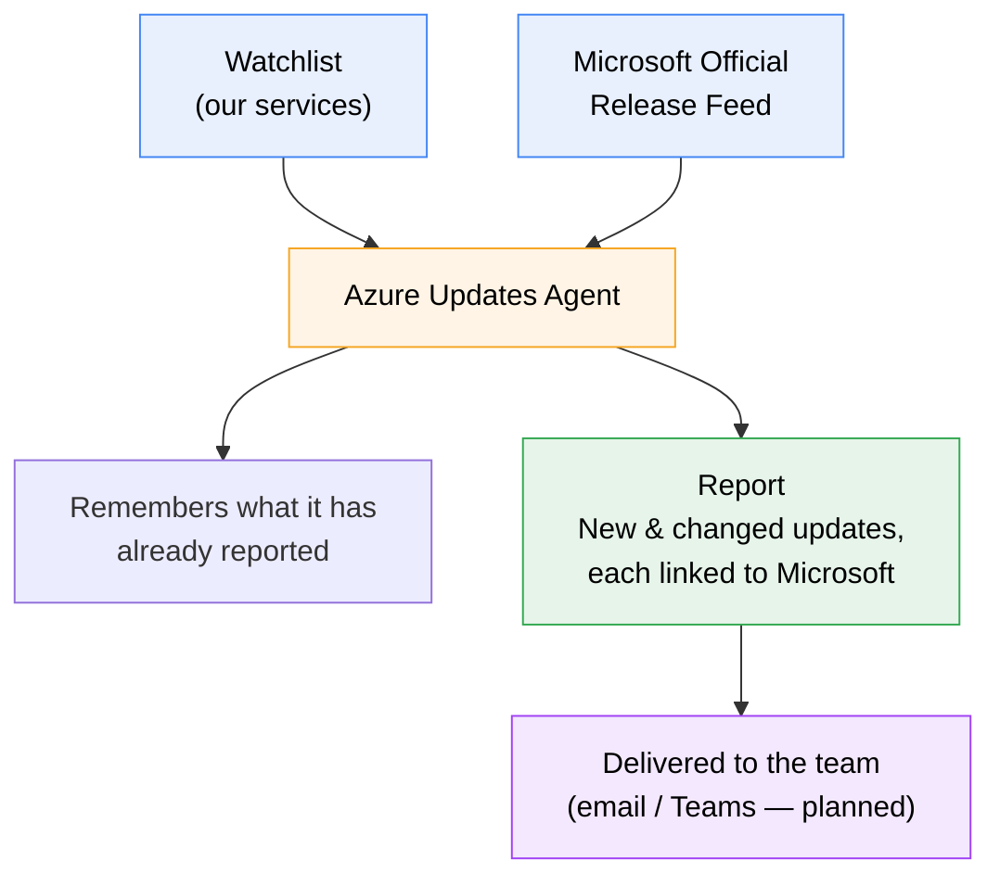

# Azure Updates Agent

**An automated watchdog for Azure service changes that matter to our team — with zero risk of made-up information.**

Every fact in every report links straight back to Microsoft's official announcement. The tool never writes its own summaries or invents details; it relays what Microsoft published, with the source receipt attached to every line.

---

## The problem this solves

Azure changes constantly — new features, security updates, and **service retirements with hard deadlines**. Today, keeping up means someone manually checking the Azure portal and blog now and then, hoping to catch the changes that affect the services we actually run. It's easy to miss something important, and a missed retirement notice can mean a broken app or a security gap discovered too late.

**This tool watches for us, automatically.** It monitors only the Azure services on our list, checks Microsoft's official release feed, and produces a clean summary of what's new — so nothing slips through.

## What it found in a recent run

From a single run across our watched services, the agent surfaced (among 21 updates):

- **A retirement deadline for .NET 8** affecting our App Service apps — security updates stop November 2026, action required.
- **TLS 1.0/1.1 being dropped** from App Service, Functions, and Logic Apps after May 2027 — anything still using old TLS versions will stop connecting.
- **A retirement of the Document Intelligence v3.0 API** — migrate by March 2029.
- **A new security ruleset** (HTTP DDoS protection) for our Application Gateway / WAF setup.

Each of these came with a direct link to Microsoft's official page. These are exactly the kinds of deadline-driven changes that are costly to miss and tedious to hunt for manually.

## How it guarantees accuracy — no hallucinations

This was a core design requirement. The tool is built so that **made-up information is structurally impossible**, not just unlikely:

- It reads updates directly from Microsoft's official release feed (the Microsoft Release Communications service).
- It never generates its own descriptions. The report is assembled from Microsoft's exact published text.
- Every item carries its **official Azure Update ID and a link** to the source page, so any claim can be verified in one click.

In short: if it's in the report, Microsoft published it — and you can prove it instantly.

## Scoped to only what we care about

Azure publishes thousands of updates. Most are irrelevant to us. The tool uses a simple, editable watchlist so it reports **only** on our services. Currently watching:

- Azure AI Document Intelligence
- App Configuration
- App Service
- Application Gateway + Web Application Firewall
- Azure Blob Storage
- Azure Container Apps
- Azure Container Registry
- Azure DNS
- Azure Data Factory
- Azure Data Lake Storage

Adding or removing a service is a one-line change in a plain-text file (`config/watchlist.yaml`). The tool validates every service name against Microsoft's live catalogue on startup — so a typo can't silently cause missed updates.

## How it works (at a glance)



The agent only reports each update **once** — on later runs it remembers what it has already seen and highlights only what's genuinely new or changed (for example, a feature moving from Preview to Generally Available).

📊 **See [VISION.md](https://github.com/Subham2901/azure-updates-agent/blob/main/VISION.md) for the full roadmap diagram** showing what's live now, what's next, and possible future directions.

## Quickstart (for developers)

Requires Python 3.12+ and [uv](https://github.com/astral-sh/uv).

```bash
# install dependencies (exact, reproducible versions)
uv sync

# see what a run would produce, without saving anything
uv run azure-updates-agent --dry-run --days 30

# generate a real report for the last 30 days
uv run azure-updates-agent --days 30
```

The report is written to `reports/latest.md`. Open it in any Markdown viewer.

### Configuration

Edit `config/watchlist.yaml` to change which services are tracked:

```yaml
products:
  - "App Service"
  - "Azure Blob Storage"
  # ... add Microsoft's exact product names here

tags:
  - "Retirements"
  - "Features"
  - "Security"
```

Service names must match Microsoft's official catalogue exactly; the tool checks this for you on every run and suggests the correct name if one is off.

## Design principles

- **Deterministic core, no AI in the data path.** The reporting pipeline uses no language model, so it cannot invent facts. (An *optional* AI summary layer is planned as a clearly-separated, citation-required add-on — see roadmap.)
- **Verify, don't assume.** Every interaction with Microsoft's feed was validated against real responses, not guessed from documentation.
- **Fail loudly on broken data, degrade gracefully on new data.** Bad or missing critical data stops the run with a clear error; unfamiliar-but-harmless data is handled without crashing.
- **Reproducible builds.** Exact dependency versions are locked, so the tool runs identically on any machine.

## Roadmap / next steps

This is a working pilot. Planned enhancements:

- **Automated delivery** — scheduled weekly run via GitHub Actions, delivering the report to email or Teams with no manual step.
- **Automated test suite & CI** — unit tests and continuous integration for enterprise-grade reliability.
- **GCP coverage** — extend the same approach to Google Cloud release notes.
- **Optional AI summary layer** — a plain-language "what this means for us" summary, strictly grounded in the fetched Microsoft data with mandatory source citations, provided as an opt-in layer that never touches the factual core.

## Data source & terms

Data comes from Microsoft's Release Communications service, which Microsoft provides publicly and without authentication. Usage is subject to Microsoft's API Terms of Use, which should be reviewed before this tool's output is relied upon in a production/compliance context.

---

*This tool consumes Azure update data via the method Microsoft officially recommends (the Microsoft Release Communications MCP server), which Microsoft promotes directly on the Azure Updates website.*
