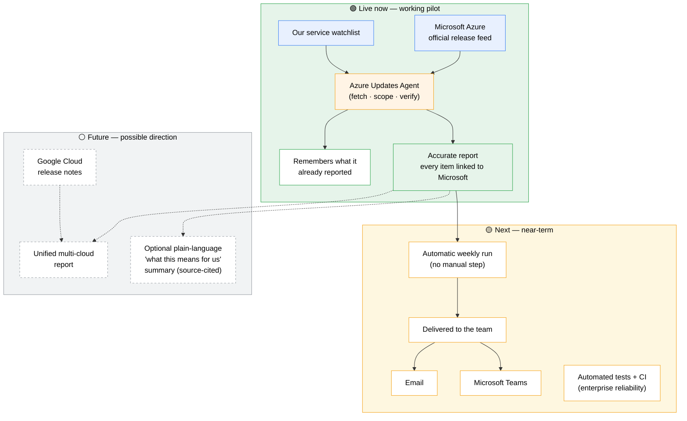

# Vision & Roadmap

This diagram shows where the Azure Updates Agent is **today** and where it can go. Status is colour-coded so it's clear what already works versus what's planned.

- 🟢 **Live now** — working in the current pilot
- 🟡 **Next** — near-term, already designed
- ⚪ **Future** — possible direction, not yet started

## In words

**Today**, the pilot reliably answers one question: *"What changed in the Azure services we depend on — and can I trust it?"* It does this with no risk of invented information, because every fact links back to Microsoft's official announcement.

**Next**, the same tool runs on a schedule and delivers itself to the team (via email, Microsoft Teams, or both), with an automated test suite backing its reliability — turning a manual check into a hands-off weekly briefing.

**In future**, the identical approach can extend to Google Cloud, giving a single unified view across the clouds we use. An optional plain-language summary layer could add a "what this means for us" note to each update — always grounded in the official source, never replacing the verifiable facts.
